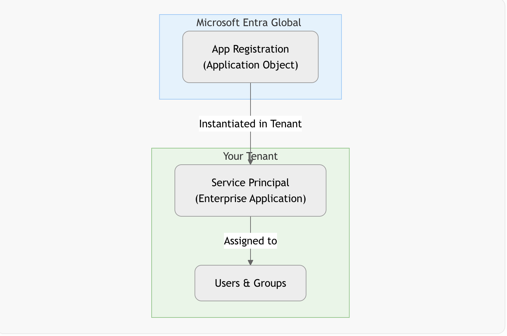
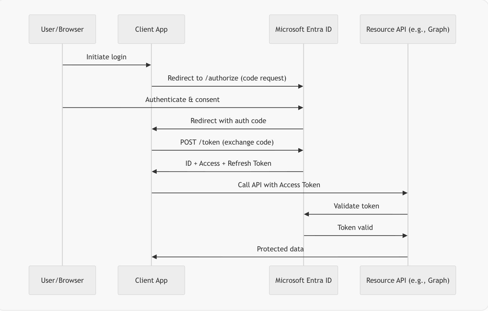
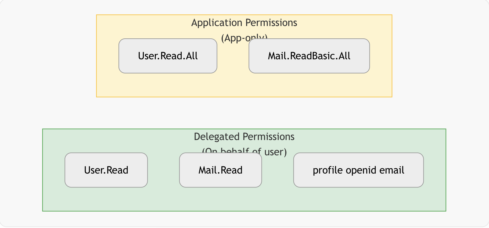
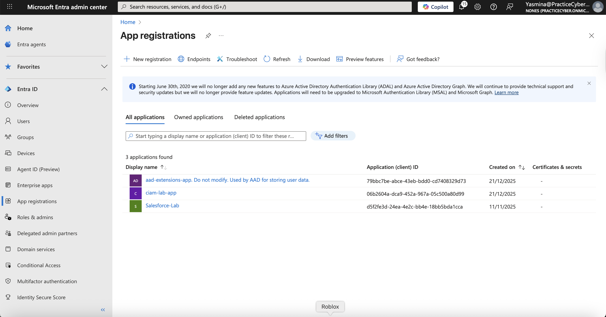
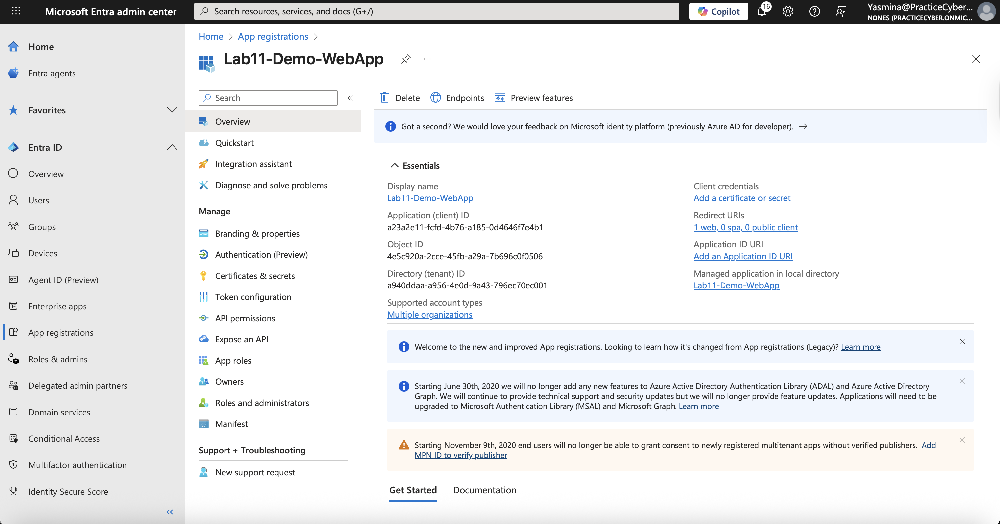

# 🔐 Lab 11 – Microsoft Entra ID App Registrations & Enterprise Applications

## 📌 Overview

This lab focuses on application identity management in Microsoft Entra ID, covering App Registrations and Enterprise Applications (service principals).
It demonstrates how to register applications, configure authentication settings, manage Microsoft Graph API permissions using the principle of least privilege, secure applications with client secrets, and apply advanced configuration through the application manifest. The lab also validates application identity behavior by reviewing enterprise applications and confirming token-based access using Microsoft Graph.
Key concepts include the distinction between App Registrations (application definitions) and Enterprise Applications (service principal instances), OAuth 2.0 and OpenID Connect fundamentals, and secure authentication mechanisms required for cloud-based application integration.
Validation is performed through configuration review and token-based access, rather than end-user interaction. Interactive user flows were intentionally excluded, as they were demonstrated in Lab 10, allowing this lab to remain focused on backend application identity configuration.
This lab demonstrates production-relevant skills applicable to roles such as Identity Engineer, Application Security Architect, Cloud Engineer, and Zero Trust-focused positions.

---
## 🎯 Lab Objectives
- Understand App Registration vs. Enterprise Application vs. Service Principal
- Register a multi-tenant web app with Authorization Code Flow
- Expose and consume a custom API
- Configure delegated and application Microsoft Graph permissions
- Create client secrets/certificates and edit manifest
- Assign roles and grant admin consent
- Test token acquisition and monitor sign-ins

---
## ⚠️ Real-World Risk
Misconfigured app registrations lead to over-privileged service principals, one of the top causes of cloud compromise (per Microsoft Security reports). Exposed secrets, excessive permissions, or lack of consent controls enable lateral movement and data exfiltration.

This lab enforces:
- Least-privilege permissions (specific scopes over broad ones)
- Admin consent workflow
- Secret rotation best practices

Aligned with Zero Trust, NIST 800-63, and Microsoft identity best practices.

## 🛠 What I Built
- Registered a multi-tenant web application (Authorization Code + PKCE)
- Exposed a custom API with app roles
- Created an Enterprise Application (service principal) in tenant
- Configured Microsoft Graph delegated (User.Read, Mail.Read) and application permissions (User.Read.All)
- Added client secret and certificate
- Modified app manifest (e.g., accessTokenAcceptedVersion = 2)
- Granted admin consent and tested via Microsoft Graph Explorer
- Cleanup: Removed secrets, deleted app registration

---

## 📐 Architecture & Flow Diagrams (Mermaid)

### Diagram 01 – App Registration vs. Enterprise Application vs. Service Principal
**Description:** Clarifies the relationship: App Registration is the global template, Enterprise App is the tenant-specific service principal.


flowchart TD

    subgraph Global [Microsoft Entra Global Directory]
        AppReg[App Registration<br/>(Application Object)]
    end
    subgraph Tenant [Your Tenant]
        SP[Service Principal<br/>(Enterprise Application)]
        Users[Users & Groups]
    end
    AppReg -->|Instantiated in Tenant| SP
    SP -->|Assigned to| Users
    style Global fill:#e3f2fd,stroke:#90caf9
    style Tenant fill:#e8f5e8,stroke:#81c784

 

----
## Diagram 02 – OAuth 2.0 Authorization Code Flow
**Description:** Standard flow used for server-side web apps.

sequenceDiagram

    participant User as User/Browser
    participant App as Client App
    participant Entra as Microsoft Entra ID
    participant Resource as Resource API (e.g., Graph)
    User->>App: Initiate login
    App->>Entra: Redirect to /authorize (code request)
    User->>Entra: Authenticate & consent
    Entra->>App: Redirect with auth code
    App->>Entra: POST /token (exchange code)
    Entra->>App: ID + Access + Refresh Token
    App->>Resource: Call API with Access Token
    Resource->>Entra: Validate token
    Entra->>Resource: Token valid
    Resource->>App: Protected data

 

## Diagram 03 (Microsoft Graph Permissions Example)
**Description:** Delegated vs. Application permissions scope.

flowchart LR

    subgraph Delegated["Delegated Permissions<br/>(On behalf of user)"]
        D1[User.Read]
        D2[Mail.Read]
        D3[profile openid email]
    end
    subgraph Application["Application Permissions<br/>(App-only)"]
        A1[User.Read.All]
        A2[Mail.ReadBasic.All]
    end
    style Delegated fill:#d4edda,stroke:#28a745
    style Application fill:#fff3cd,stroke:#ffc107

  

 ----

## Example App Manifest Snippet (Key Sections)
**Description:** Critical manifest properties. 

```
  {
	"id": "4e5c920a-2cce-45fb-a29a-7b696c0f0506",
	"deletedDateTime": null,
	"appId": "a23a2e11-fcfd-4b76-a185-0d4646f7e4b1",
	"applicationTemplateId": null,
	"disabledByMicrosoftStatus": null,
	"createdDateTime": "2025-12-21T18:21:43Z",
	"displayName": "Lab11-Demo-WebApp",
	"description": null,
	"groupMembershipClaims": null,
	"identifierUris": [],
	"isDeviceOnlyAuthSupported": null,
	"isFallbackPublicClient": null,
	"nativeAuthenticationApisEnabled": null,
	"notes": null,
	"publisherDomain": "PracticeCyber.onmicrosoft.com",
	"serviceManagementReference": null,
	"signInAudience": "AzureADMultipleOrgs",
	"tags": [],
	"tokenEncryptionKeyId": null,
	"samlMetadataUrl": null,
	"defaultRedirectUri": null,
	"certification": null,
	"optionalClaims": null,
	"requestSignatureVerification": null,
	"addIns": [],
	"api": {
		"acceptMappedClaims": null,
		"knownClientApplications": [],
		"requestedAccessTokenVersion": 2,
		"oauth2PermissionScopes": [],
		"preAuthorizedApplications": []
	},
	"appRoles": [],
	"info": {
		"logoUrl": null,
		"marketingUrl": null,
		"privacyStatementUrl": null,
		"supportUrl": null,
		"termsOfServiceUrl": null
	},
	"keyCredentials": [],
	"parentalControlSettings": {
		"countriesBlockedForMinors": [],
		"legalAgeGroupRule": "Allow"
	},
	"passwordCredentials": [
		{
			"customKeyIdentifier": null,
			"displayName": "Lab client secret",
			"endDateTime": "2026-06-19T18:24:42.529Z",
			"hint": "AR2",
			"keyId": "8faa26e5-993f-4846-8081-b0c03bbe7b65",
			"secretText": null,
			"startDateTime": "2025-12-21T19:24:42.529Z"
		}
	],
	"publicClient": {
		"redirectUris": []
	},
	"requiredResourceAccess": [
		{
			"resourceAppId": "00000003-0000-0000-c000-000000000000",
			"resourceAccess": [
				{
					"id": "e1fe6dd8-ba31-4d61-89e7-88639da4683d",
					"type": "Scope"
				}
			]
		}
	],
	"verifiedPublisher": {
		"displayName": null,
		"verifiedPublisherId": null,
		"addedDateTime": null
	},
	"web": {
		"homePageUrl": null,
		"logoutUrl": null,
		"redirectUris": [
			"https://jwt.ms"
		],
		"implicitGrantSettings": {
			"enableAccessTokenIssuance": false,
			"enableIdTokenIssuance": false
		},
		"redirectUriSettings": [
			{
				"uri": "https://jwt.ms",
				"index": null
			}
		]
	},
	"servicePrincipalLockConfiguration": {
		"isEnabled": true,
		"allProperties": true,
		"credentialsWithUsageVerify": true,
		"credentialsWithUsageSign": true,
		"identifierUris": false,
		"tokenEncryptionKeyId": true
	},
	"spa": {
		"redirectUris": []
	}
}


```

## 📊 Evidence Summary (Screenshots)

| # | Action | Screenshot |
| - | ------ | ---------- |
| 1 | App Registrations Dashboard |  |
| 2 | New App Registration Creation |  |
| 3 | Authentication & Redirect URIs |  |
| 4 | API Permissions (Graph) |  |
| 5 | Certificates & Secrets |  |
| 6 | Manifest Editor |  |
| 7 | Enterprise App & Admin Consent |  |
| 8 | Token Test in Graph Explorer |  |

---

## 🧪 Step-by-Step Implementation
## 1️⃣ Access App Registrations Dashboard
Purpose: Overview of registered applications and service principals.
## Actions:

Microsoft Entra admin center → Microsoft Entra ID → App registrations

**Validation:** List of existing apps.

📸 Screenshot: App-Registrations.png

## 2️⃣ Create New App Registration
Purpose: Define the application template.
## Actions:

## Click New registration
Name: "Lab11-Demo-WebApp"
Supported account types: Accounts in any organizational directory (Multitenant)
Redirect URI: Web → https://jwt.ms (for testing)

**Validation:** App created with Application (client) ID.

📸 Screenshot: new-app-registration.png

## 3️⃣ Configure Authentication & Platform

**Purpose:**  
Configure application authentication settings to support OAuth 2.0 flows in Microsoft Entra ID.

### Actions
- Navigate to **Microsoft Entra ID > App registrations**
- Select the target application
- Open **Authentication**
- Add a **Web** platform
- Configure **Redirect URI** as: https://jwt.ms
- Save the configuration

📸 **Screenshot:** `auth-config.png`

### Validation
- The application has a Web platform configured
- The redirect URI is correctly set


## 4️⃣ Configure API Permissions

**Purpose:**  
Apply least-privilege access to Microsoft Graph by configuring only the required delegated permissions.

### Actions
- Navigate to **Microsoft Entra ID > App registrations**
- Select the target application
- Open **API permissions**
- Add **Microsoft Graph** delegated permission:
  - **User.Read**
- Save the configuration

> **Note:**  
> Additional permissions such as Mail.Read are not available in this tenant because Exchange Online is not provisioned.

### Validation
- Required Microsoft Graph permissions are configured
- No excessive permissions are assigned

**📸 Screenshot:** permissions.png

## 5️⃣ Manage Certificates & Secrets
Purpose: Secure app authentication.

## Actions:

Microsoft Entra admin center → Microsoft Entra ID → App registrations → (tu app) → Certificates & secrets

**Validation:** 
- A client secret was created for the application to enable secure authentication.
- The secret value was copied at creation time and is not retrievable afterward,
- following Microsoft Entra ID security best practices.

**📸 Screenshot:** secrets.png

## 6️⃣ Edit Application Manifest
Purpose: Advanced configuration not exposed in UI.
## Actions:

- Manifest → Modify:
- "accessTokenAcceptedVersion": 2 (for v2 tokens)
- "signInAudience": "AzureADMultipleOrgs"


**Validation:** 
- The application manifest was updated to enable v2.0 access tokens and allow multi-tenant sign-in.
- Changes were successfully saved in the Microsoft Entra ID application manifest.
 
📸 Screenshot: manifest.png

## 7️⃣ View Enterprise Application & Test

**Purpose:**  
Verify that the enterprise application (service principal) exists and that token issuance works correctly.

### Actions
- Navigate to **Microsoft Entra ID > Enterprise applications**
- Locate and open the application
- Confirm the service principal is present and enabled
- Open **https://jwt.ms** and sign in
- Review decoded token claims

### Validation
- Enterprise application is visible
- Microsoft Graph Explorer was used to validate token issuance and Graph access.
- A successful `/me` request returned HTTP 200, confirming delegated permissions and authentication flow in the tenant sample environment.


📸 **Screenshot:** `graph-explorer.png`


## ✅ Expected Results

- Secure multi-tenant app registration
- Correct OAuth2 flow with consented permissions
- Valid tokens containing expected claims/scopes
- Service principal properly instantiated


## 🔐 License Requirement
- Microsoft Entra ID P1/P2 for advanced features (admin consent workflow, conditional access on apps).
- Basic app registration is available in Free tier.

## 🧰 Tools & Services Used

- Microsoft Entra admin center
- App registrations & Enterprise applications
- Microsoft Graph API & Graph Explorer
- jwt.ms for token decoding

This lab provides strong evidence of deep knowledge in Entra ID application identity management, critical for securing modern cloud and SaaS integrations.
