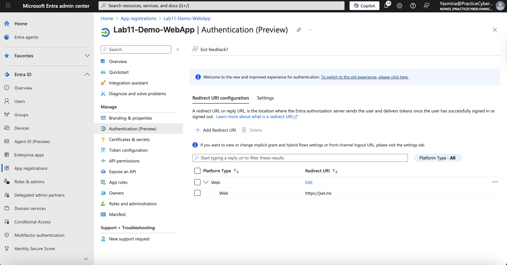
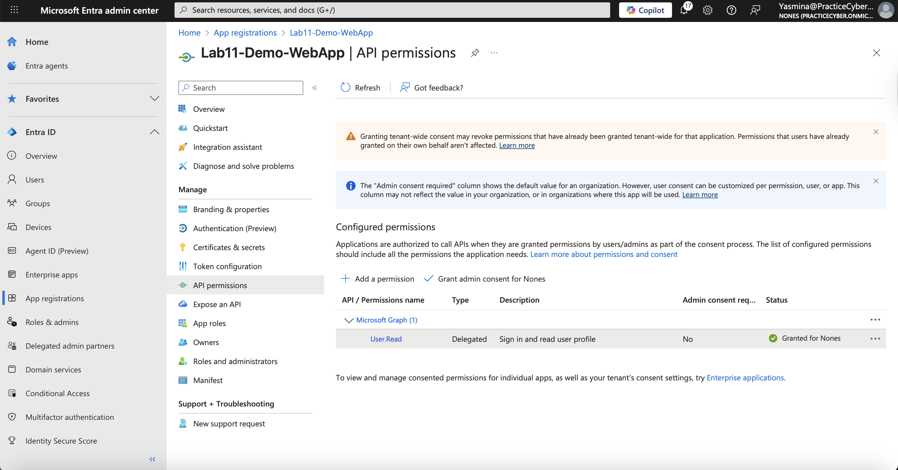
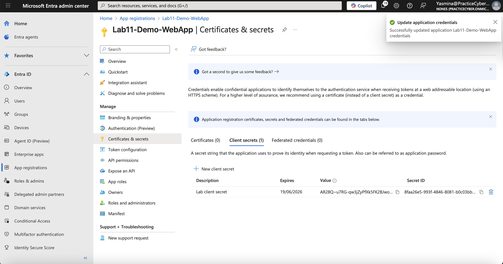
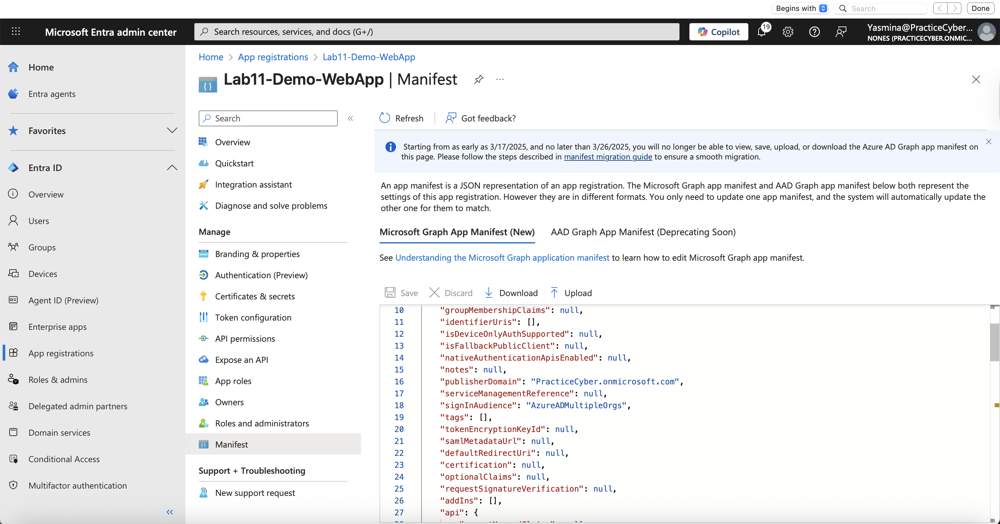
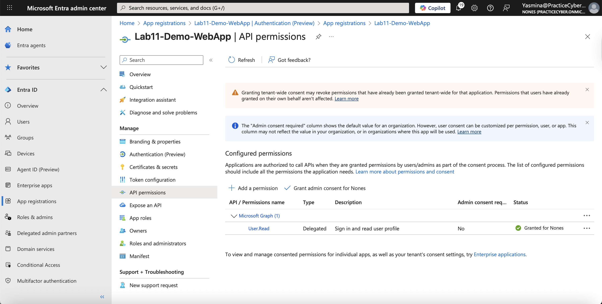
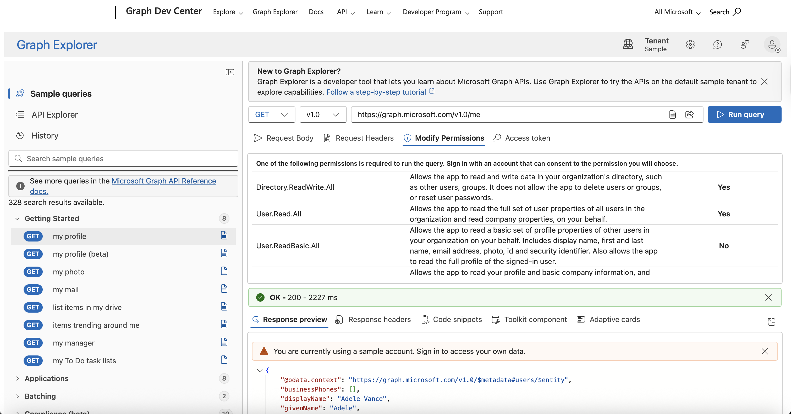

# 🔐 Lab 11 – Microsoft Entra ID App Registrations & Enterprise Applications

## 📌 Overview
This lab demonstrates core **Identity and Access Management (IAM)** skills by configuring **App Registrations** and **Enterprise Applications** in Microsoft Entra ID. It covers registering custom applications, exposing APIs, configuring OAuth2 flows, granting Microsoft Graph permissions, and managing service principals.

Key concepts include the difference between App Registrations (template) and Enterprise Applications (service principal instances), least privilege API permissions, and secrets/certificates for authentication, essential for secure application integration and API access in cloud environments.

This hands-on work proves production-level expertise in application identity management, highly relevant for **Identity Engineer, Application Security Architect, Cloud Developer, and Zero Trust roles**.

---
## 🎯 Lab Objectives
- Understand App Registration vs. Enterprise Application vs. Service Principal
- Register a multi-tenant web app with Authorization Code Flow
- Expose and consume a custom API
- Configure delegated and application Microsoft Graph permissions
- Create client secrets/certificates and edit manifest
- Assign roles and grant admin consent
- Test token acquisition and monitor sign-ins

---
## ⚠️ Real-World Risk
Misconfigured app registrations lead to over-privileged service principals, one of the top causes of cloud compromise (per Microsoft Security reports). Exposed secrets, excessive permissions, or lack of consent controls enable lateral movement and data exfiltration.

This lab enforces:
- Least-privilege permissions (specific scopes over broad ones)
- Admin consent workflow
- Secret rotation best practices

Aligned with Zero Trust, NIST 800-63, and Microsoft identity best practices.

## 🛠 What I Built
- Registered a multi-tenant web application (Authorization Code + PKCE)
- Exposed a custom API with app roles
- Created an Enterprise Application (service principal) in tenant
- Configured Microsoft Graph delegated (User.Read, Mail.Read) and application permissions (User.Read.All)
- Added client secret and certificate
- Modified app manifest (e.g., accessTokenAcceptedVersion = 2)
- Granted admin consent and tested via Microsoft Graph Explorer
- Cleanup: Removed secrets, deleted app registration

---
## 🎥 Suggested Demo Animation
Create a GIF (e.g., `app-reg-demo.gif`) showing:
- App registration creation → API permissions → Grant admin consent → Token acquisition

Example placeholder (replace with yours):


---
## 📐 Architecture & Flow Diagrams (Mermaid)

### Diagram 01 – App Registration vs. Enterprise Application vs. Service Principal
**Description:** Clarifies the relationship: App Registration is the global template, Enterprise App is the tenant-specific service principal.


flowchart TD

    subgraph Global [Microsoft Entra Global Directory]
        AppReg[App Registration<br/>(Application Object)]
    end
    subgraph Tenant [Your Tenant]
        SP[Service Principal<br/>(Enterprise Application)]
        Users[Users & Groups]
    end
    AppReg -->|Instantiated in Tenant| SP
    SP -->|Assigned to| Users
    style Global fill:#e3f2fd,stroke:#90caf9
    style Tenant fill:#e8f5e8,stroke:#81c784

## Diagram 02 – OAuth 2.0 Authorization Code Flow
**Description:** Standard flow used for server-side web apps.

sequenceDiagram

    participant User as User/Browser
    participant App as Client App
    participant Entra as Microsoft Entra ID
    participant Resource as Resource API (e.g., Graph)
    User->>App: Initiate login
    App->>Entra: Redirect to /authorize (code request)
    User->>Entra: Authenticate & consent
    Entra->>App: Redirect with auth code
    App->>Entra: POST /token (exchange code)
    Entra->>App: ID + Access + Refresh Token
    App->>Resource: Call API with Access Token
    Resource->>Entra: Validate token
    Entra->>Resource: Token valid
    Resource->>App: Protected data


## Diagram 03 (Microsoft Graph Permissions Example)
**Description:** Delegated vs. Application permissions scope.

flowchart LR

    subgraph Delegated["Delegated Permissions<br/>(On behalf of user)"]
        D1[User.Read]
        D2[Mail.Read]
        D3[profile openid email]
    end
    subgraph Application["Application Permissions<br/>(App-only)"]
        A1[User.Read.All]
        A2[Mail.ReadBasic.All]
    end
    style Delegated fill:#d4edda,stroke:#28a745
    style Application fill:#fff3cd,stroke:#ffc107

## Example App Manifest Snippet (Key Sections)
**Description:** Critical manifest properties. 

```
  "accessTokenAcceptedVersion": 2,
  "signInAudience": "AzureADMultipleOrgs",
  "optionalClaims": {
    "idToken": [
      { "name": "preferred_username" },
      { "name": "email" }
    ]
  },
  "requiredResourceAccess": [
    {
      "resourceAppId": "00000003-0000-0000-c000-000000000000",
      "resourceAccess": [
        { "id": "e1fe6dd8-ba31-4d61-89e7-88639da4683d", "type": "Scope" }, // User.Read
        { "id": "64a6cdd6-aab1-4aaf-94b8-3cc8ce4a5506", "type": "Role" }   // User.Read.All
      ]
    }
  ]
}


```

## 📊 Evidence Summary (Screenshots)

| # | Action | Screenshot |
| - | ------ | ---------- |
| 1 | App Registrations Dashboard |  |
| 2 | New App Registration Creation |  |
| 3 | Authentication & Redirect URIs |  |
| 4 | API Permissions (Graph) |  |
| 5 | Certificates & Secrets |  |
| 6 | Manifest Editor |  |
| 7 | Enterprise App & Admin Consent |  |
| 8 | Token Test in Graph Explorer |  |

---

## 🧪 Step-by-Step Implementation
## 1️⃣ Access App Registrations Dashboard
Purpose: Overview of registered applications and service principals.
## Actions:

Microsoft Entra admin center → Identity → Applications → App registrations

**Validation:** List of existing apps.

📸 Screenshot: dashboard.png

## 2️⃣ Create New App Registration
Purpose: Define the application template.
## Actions:

## Click New registration
Name: "Lab11-Demo-WebApp"
Supported account types: Accounts in any organizational directory (Multitenant)
Redirect URI: Web → https://jwt.ms (for testing)

**Validation:** App created with Application (client) ID.

📸 Screenshot: app-registration.png

## 3️⃣ Configure Authentication & Platform
Purpose: Enable OAuth2 Authorization Code Flow.

## Actions:

- Authentication → Add platform → Web
- Redirect URI: https://jwt.ms
- Enable ID tokens & Access tokens
- Front-channel logout URL (optional)

📸 Screenshot: auth-config.png

## 4️⃣ Configure API Permissions
Purpose: Apply least-privilege access to Microsoft Graph.

## Actions:

- API permissions → Add a permission → Microsoft Graph
- Delegated: User.Read, Mail.Read
- Application: User.Read.All
- Click Grant admin consent for [tenant]

**Validation:** Consent granted, no pending requests.

📸 Screenshot: permissions.png

## 5️⃣ Manage Certificates & Secrets
Purpose: Secure app authentication.

## Actions:

Certificates & secrets → New client secret (description, expiry 6 months)
(Optional) Upload certificate for production

**Validation:** Secret value copied (never visible again).

📸 Screenshot: secrets.png

## 6️⃣ Edit Application Manifest
Purpose: Advanced configuration not exposed in UI.
## Actions:

- Manifest → Modify:
- "accessTokenAcceptedVersion": 2 (for v2 tokens)
- "signInAudience": "AzureADMultipleOrgs"


**Validation:** Changes saved.

📸 Screenshot: manifest.png

## 7️⃣ View Enterprise Application & Test
Purpose: Verify service principal and token flow.
## Actions:

- Enterprise applications → Find your app → Grant admin consent if needed
- Test: Open https://jwt.ms → Sign in → Observe decoded token claims Or use Microsoft Graph Explorer with your app

**Validation:** Valid access token with correct scopes.

📸 Screenshots: graph-explorer.png

## ✅ Expected Results

- Secure multi-tenant app registration
- Correct OAuth2 flow with consented permissions
- Valid tokens containing expected claims/scopes
- Service principal properly instantiated


## 🔐 License Requirement
- Microsoft Entra ID P1/P2 for advanced features (admin consent workflow, conditional access on apps).
- Basic app registration is available in Free tier.

## 🧰 Tools & Services Used

- Microsoft Entra admin center
- App registrations & Enterprise applications
- Microsoft Graph API & Graph Explorer
- jwt.ms for token decoding

This lab provides strong evidence of deep knowledge in Entra ID application identity management, critical for securing modern cloud and SaaS integrations.
