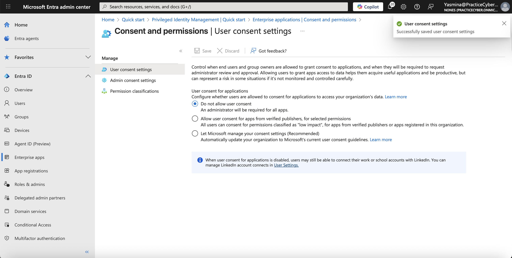
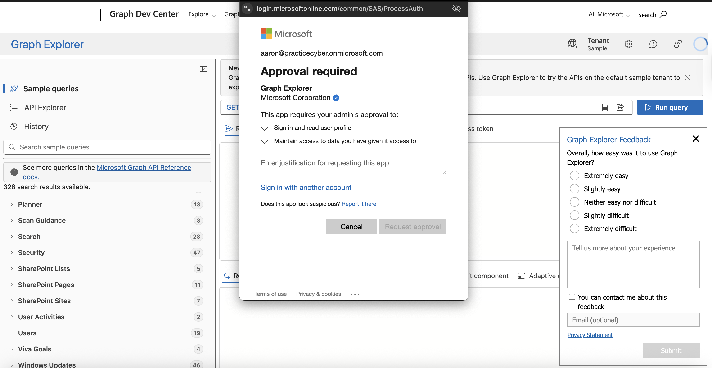
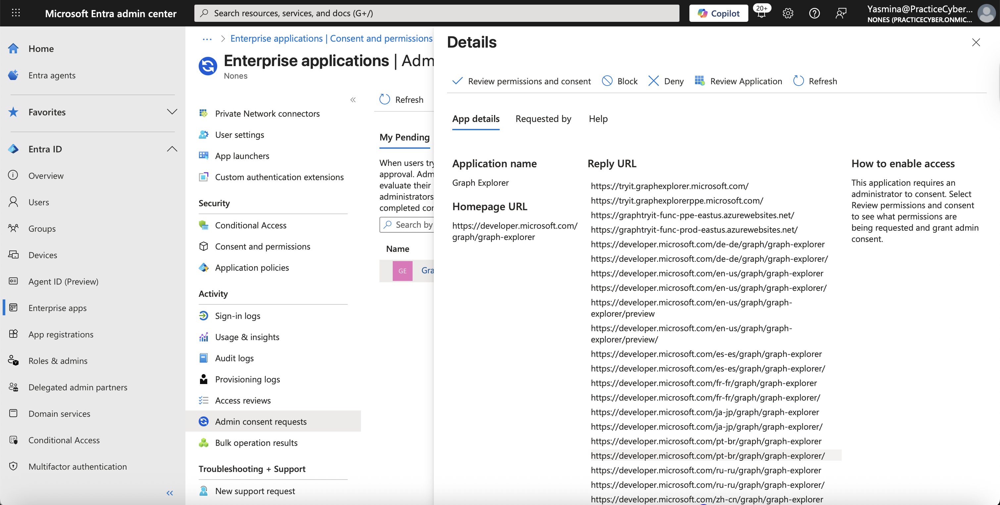
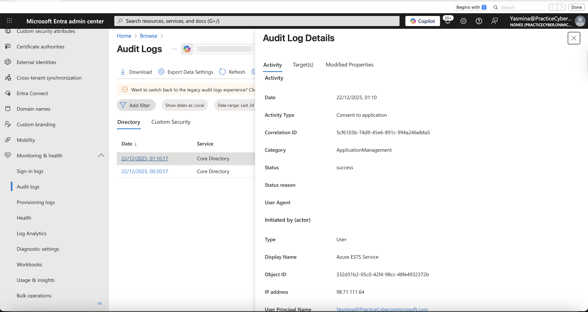

# 🔐 Lab 12 – Admin Consent & Workflow Approval

## 📌 Overview
This lab showcases advanced **Identity Governance** expertise by implementing **Admin Consent Controls** and **Admin Consent Workflow** in Microsoft Entra ID. These features prevent end-users from independently granting high-risk permissions to applications, instead routing sensitive consent requests through a formal approval process.

The configuration enforces strict governance over OAuth consent, significantly reducing risks from malicious apps, over-privileged permissions, and illicit consent grants — a critical Zero Trust control for enterprise application security.

Highly valuable for **IAM Engineer, Identity Governance Specialist, Cloud Security Architect, and Compliance Officer** roles.

---
## 🎯 Lab Objectives
- Block or restrict user consent for applications
- Enable and configure Admin Consent Workflow
- Create targeted approval policies for high-risk permissions
- Simulate consent requests as an end user/developer
- Review, approve, and deny requests as an administrator
- Validate full audit trail of consent decisions

---
## ⚠️ Real-World Risk
Illicit consent grants are a top attack vector: attackers trick users into approving malicious apps that request broad permissions (e.g., `Mail.ReadWrite`, `Files.Read.All`), leading to data theft and account compromise.

This lab mitigates:
- Phishing-driven OAuth consent attacks
- Over-privileged third-party applications
- Lack of visibility into consent grants

Aligned with:
- Microsoft Zero Trust guidance
- NIST 800-63B (Authenticator Assurance Levels)
- Regulatory requirements (GDPR, SOX, HIPAA)

## 🛠 What I Built
- Completely blocked user consent
- Enabled Admin Consent Workflow
- Created a workflow requiring approval for all application permissions containing ".All"
- Tested the end-to-end request flow using Microsoft Graph Explorer
- Approved a request as admin
- Verified detailed audit logging
- Cleanup: Disabled workflow and restored safe consent settings

---
## 🎥 Suggested Demo Animation
Create a GIF (e.g., `admin-consent-workflow.gif`) demonstrating:
- User blocked from consenting → Submits request → Admin reviews & approves → Access granted


---
## 📐 Architecture & Flow Diagrams (Mermaid)

### Diagram 01 – Consent Governance Models
**Description:** Comparison of consent approaches and their security posture.

flowchart TD


    subgraph UserConsent["User Consent (High Risk)"]
        UC1[User accepts prompt]
        UC2[App immediately receives tokens]
        UC3[No admin oversight]
    end
    subgraph AdminOnly["Admin Consent Only"]
        AC1[User consent blocked]
        AC2[Global admin grants directly]
        AC3[Limited scalability]
    end
    subgraph Workflow["Admin Consent Workflow (Best Practice)"]
        WF1[User blocked for risky perms]
        WF2[Request + justification submitted]
        WF3[Designated approvers review]
        WF4[Consent granted only after approval]
    end
    style UserConsent fill:#f8d7da,stroke:#dc3545
    style AdminOnly fill:#fff3cd,stroke:#ffc107
    style Workflow fill:#d4edda,stroke:#28a745

---

## Diagram 02 – Admin Consent Workflow Process Flowlow
 **Description:**  End-to-end lifecycle of a consent request

sequenceDiagram

    participant User as End User/Developer
    participant App as Third-Party App
    participant Entra as Microsoft Entra ID
    participant Approver as Consent Approver
    User->>App: Interact with app
    App->>Entra: Request permissions (e.g., User.Read.All)
    Entra-->>User: Consent blocked – "Request admin approval"
    User->>Entra: Submit request with business justification
    Entra->>Approver: Email notification + Portal alert
    Approver->>Entra: Review app risk, permissions, justification
    Approver->>Entra: Approve or Deny
    alt Approved
        Entra-->>App: Consent granted
        Entra-->>User: Access now works
    else Denied
        Entra-->>User: Access denied
    end


## Example Admin Consent Workflow Policy (Key Configuration)
**Description:** Sample policy targeting high-risk application permissions (proof of precise control).
```
{  "displayName": "Require Approval for All Application Permissions with '.All'",
  "isEnabled": true,
  "permissionType": "application",
  "permissionClassification": "all",
  "requireJustification": true,
  "notifyReviewers": true,
  "remindersEnabled": true,
  "requestDurationInDays": 30,
  "reviewers": [
    {
      "query": "/groups/{id-of-app-consent-approvers-group}",
      "queryType": "MicrosoftGraph"
    }
  ]
}


```

## 📊 Evidence Summary (Screenshots)

| # | Action | Screenshot |
| - | ------ | ---------- |
| 1 | User Consent Settings (Blocked) |  |
| 2 | Enable Admin Consent Workflow |  |
| 3 | Create New Workflow Policy |  |
| 4 | Policy Configuration & Reviewers |  
| 5 | User Blocked – Consent Prompt |  |
| 6 | Submit Admin Consent Request |  |
| 7 | Admin Review & Approval |  |
| 8 | Audit Logs – Consent Events |  |

---
 ## 🧪 Step-by-Step Implementation

## 1️⃣ Block User Consent
**Purpose:**  
Eliminate the highest-risk consent vector by preventing standard users from granting application permissions.

### Actions
- Navigate to **Microsoft Entra admin center**
- Go to **Enterprise applications**
- Select **Consent and permissions**
- Set **Users can consent to apps accessing company data** → **Do not allow user consent**

### Validation
- Standard users can no longer approve consent prompts

📸 **Screenshot:** `user-consent-settings.png`

---

## 2️⃣ Enable Admin Consent Workflow
**Purpose:**  
Activate governance controls for managed and auditable permission approvals.

### Actions
- In **Consent and permissions**, open **Admin consent workflow**
- Set **Enable admin consent workflow** → **Yes**

### Validation
- The **Admin consent requests** blade becomes available

📸 **Screenshot:** `admin-consent-workflow.png`

---

## 3️⃣ Admin Consent Workflow Policy (Default – Tenant Limitation)

**Purpose:**  
Ensure that high-impact permissions require explicit administrative approval.

### Actions
- Navigate to **Admin consent workflow**
- Verify that the admin consent workflow is enabled at the tenant level

> **Note:**  
> This tenant does not support creating custom admin consent workflow policies.
> As a result, the **New workflow** option is not available.
> The default admin consent workflow is used to enforce approval for high-risk permissions.

### Validation
- Admin consent workflow is enabled
- Admin consent requests can be submitted and reviewed

📸 **Screenshot:**  
- `enable-admin-consent-workflow.png`


## 4️⃣ Simulate Consent Request (End-User View)
**Purpose:**  
Validate the blocked consent experience and request submission flow.

### Actions
- Sign in as a **non-admin user**
- Open **Microsoft Graph Explorer**
- Attempt a query requiring admin-level permissions  
  (e.g., `GET /users` → requires `User.Read.All`)
- Observe the blocked consent prompt
- Select **Request admin approval**
- Enter justification and submit the request

### Validation
- A standard user attempted to access Microsoft Graph permissions requiring admin consent.
- The request was blocked and submitted through the admin consent workflow, validating the governance control.
- Consent request is successfully submitted


📸 **Screenshots:**  
- `user-blocked-consent.png`  
- `submit-admin-consent-request.png`

---

## 5️⃣ Review and Approve Request (Admin View)
**Purpose:**  
Validate the administrative review and approval process.

### Actions
- Navigate to **Admin consent requests**
- Open the pending request
- Review:
  - Application details
  - Requested permissions
  - Business justification
  - Risk indicators
- Approve (or deny) the request with an optional comment

### Validation
- Request status changes to **Approved**
- User can successfully execute the previously blocked query

## note:
Once admin consent was approved for Microsoft Graph Explorer, permissions were granted tenant-wide. Subsequent users were able 
to access the application without additional consent prompts, which is expected behavior in Microsoft Entra ID.


📸 **Screenshot:** `admin-review-approval.png`

---

## 6️⃣ Verify Audit Trail
**Purpose:**  
Ensure full traceability and compliance through audit logging.

### Actions
- Navigate to **Identity > Audit logs**
- Apply filters:
  - **Category:** ApplicationManagement
  - **Activity:**  
    - Consent to application  
    - Admin consent request updated

### Validation
- Audit logs show the full lifecycle:
  request creation, review, and approval decision

📸 **Screenshot:** `audit-logs-consent.png`

---


## ✅ Expected Results

- Zero unauthorized user consent grants
- All high-risk permission requests routed through approvers
- Complete audit history of consent decisions
- Secure, governed application integration process


## 🔐 License Requirement
Microsoft Entra ID P2 or Microsoft Entra ID Governance license required for Admin Consent Workflow.

## 🧰 Tools & Services Used

- Microsoft Entra admin center
- Enterprise applications → Consent and permissions
- Admin consent requests
- Microsoft Graph Explorer
- Audit logs

This lab provides strong, verifiable evidence of expertise in Entra ID consent governance and the key defense against one of the most common cloud attack techniques.
